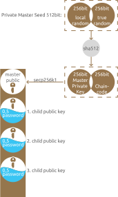

# Backup tier

The purpose of the **Backup tier** is to guarantee "password" consistency for users and service providers. It ensures that you always have an option to recover, even if you've lost all your devices/passwords.

* Users can set their minds at ease knowing that they can't lose access to their encrypted services \(data, bitcoins,..\). 
* Service providers can start deploying their recovery codes \(security questions,..\) to the ZeroPass app. Services can skip their recovery procedures \(filled with human error scenarios\), knowing that users can always recover within ZeroPass.     
* Businesses can ensure that they will never be locked-out of their encrypted data again.

It is designed to be used rarely \(if ever\). That means that some complexity is introduced in form of distribution of control over who can actually achieve the [**recovery** procedure](https://github.com/zeropass/whitepaper/tree/11e905277aa925050db5761f02986a99c0abde42/recovery.html). ZeroPass servers **can not** recover your keys without user's own "local web of trust".

## Encryption \(public/private key\)

We use Elliptic Curve Integrated Encryption Scheme \([ECIES](https://en.wikipedia.org/wiki/Integrated_Encryption_Scheme)\) to encrypt all of your passwords with public key and decrypt them with private key. This way we can throw away private key\(s\), and just store public keys within ZeroPass app. Even if an App is compromised, public key\(s\) are useless to the attacker. Public key can only be used to backup/store password \(one way\) to achieve recovery procedure you need to recover private key first. See ["Key Split"](https://github.com/zeropass/whitepaper/tree/11e905277aa925050db5761f02986a99c0abde42/key_split.html) section to see how the recovery of your "private key"\(Master Seed\) is designed.

## Key derivation

One _private/public_ keypair _could_ do the job, unfortunately some risks still remain. It's a good practice to reuse same key as little as possible, avoiding unnecessary exposure and future risk of possible unknown collisions. This is why key derivation is used to create new keypair for each new \[password slot\].

#### Creation of Private Master Seed

Private Master Seed \(512 bit\) is needed to decrypt all of your backed up keys.

1. For the first half \(256 bit\) of the master seed, we use **LocalRandomNumber** generator-including random movements from the mouse. It ensures that this number is not logged on a distant server and never leaves your machine.
2. For second half \(256 bit\) server supplies; **TrueRandomNumber**. The second half is delivered from well researched true random events. This ensures that no pattern arises in PrivateMasterSeed from limitations of your local machine to produce a true random number.

Master Private Seed never leaves your device and it's never stored on your device. It gets derived, split, distributed and afterwards erased.

#### Key derivation  based on [BIP32](https://github.com/bitcoin/bips/blob/master/bip-0032.mediawiki) 

Private Master Seed is run through a secure hash function \(**SHA-512**\). The resulting 512 bit hash is split into two parts:

1. **Master Private Key** \(256 bit\). From this key, we derive **Master Public Key**
2. **ChainCode** \(256 bit\) is used repeatedly during derivation and increases entropy

After that, we create new child public key for each \[password slot\]

Master public key is securely distributed between your devices.

Master Private Seed itself never leaves your device and is never stored on your device. It gets derived, split, distributed and then erased.

#### Child public key and Credential backup share  \(see [Credentials tier](https://github.com/zeropass/whitepaper/tree/11e905277aa925050db5761f02986a99c0abde42/credentials_tier.html)\)

* Bip32 derivation takes Master Public Key and derives next Child public key. 
* We use this Child Public key to encrypt third part of credential share with \(ECIES\).
* Store encrypted part in the app.

At the end of a backup procedure, backups are sent to the server and to all your devices where they are stored. Each device gets an identical copy of the encrypted classified data and keeps it forever.

### References:

