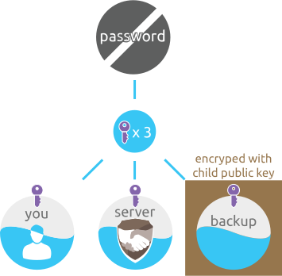
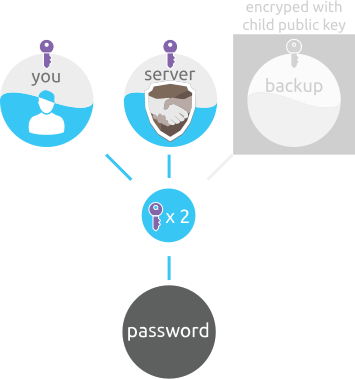

# Credentials tier

The purpose of the Credentials tier is to provide "password" reconstruction for everyday use \(sign-in to your favourite website\). It is designed to split"password" into three parts where the first part is sent to the server and the second part is stored in your app. The third part, called credential backup share, is encrypted with slot’s public key and shared between server and devices \(see [recovery](https://github.com/zeropass/whitepaper/tree/11e905277aa925050db5761f02986a99c0abde42/recovery.html)\). The division ensures that there is no single point of attack, and offers some 'easy to edit' restrictions on access to each individual "password".

## Store "password"

### Split it

When you add new "password", it gets split into three parts \(using Shamir's secret sharing scheme\).

* First part is stored in the app using device OS based encryption key \([TPM](https://en.wikipedia.org/wiki/Trusted_Platform_Module) if present\).
* Second part is sent to ZeroPass server and is saved to your account.
* Third part is encrypted with slot’s public key \(slot Id\) and shared between server and devices. See [Backup tier](https://github.com/zeropass/whitepaper/tree/11e905277aa925050db5761f02986a99c0abde42/backup_tier.html) for more details.

After the split and backup operation, the original "password" will be deleted.

Even if your app or our server is breached by malicious attackers, they will only get a part of the secret share which is not enough to reconstruct the original "password", leaving him with no access.

## Reconstruct the divided "password"

If you want to \(for example\) input password into app/website, the following happens:

* ZeroPass app sends a signed request for a specific "password" to the ZeroPass server.
* The ZeroPass server checks the signature of the request to verify it originated from the actual client.
* If a two-factor authentication is in use \(default\), server requests another signature from your secondary device in order to return the shared 'half' of the requested "password". 
  * ZeroPass server sends a signed request to your secondary device.
  * Client App has to confirm the request for the specific "password", sign it and send it back to the ZeroPass server. 
  * The server verifies the signature of the secondary device.
  * Additionally, server will also do a number of verifications to ensure the best security model:
    * Check for other malicious activities like password-guessing attack, GeoIP from where the requests are coming from, the number of total sign-ups in a period of time, etc.
    * Check if LockDown is active for the device that sends a signed request. In case your device gets stolen, you can block all activities from that device until the situation is resolved. For example, if your phone gets stolen, you will usually buy a new phone and then register it as a new device to ZeroPass. 
    * Create a trusted log entry that presents all activity \(of all of your devices\) back to you.
    * If a suspicious activity is detected, a notification will be sent to all of your devices and to your email as well.
* When everything is OK \(and no malicious activity was detected\) ZeroPass server will respond and send 'shared half' of the requested "password", back to the ZeroPass app that requested it \(encrypted with the private key from the same device public key\).
* After the requesting client receives the other 'half' from the server the divided "password" is reconstructed.
* After reconstruction, ZeroPass app will have a complete "password" and the user can copy-paste it to the endpoint application for authentication \(alternatively,  browser extension can auto-fill it for him\).
* After the user has signed into the endpoint application, the reconstructed "password" will be deleted from clipboard and memory, which will happen automatically over a minimal period of time \(not set yet\).

Part \(share\) of the "password" that is stored in your app ensures that you are always in control - it never touches our servers \(Zero-knowledge design\).

### References:

