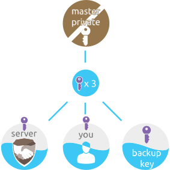
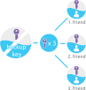

# Key split

The purpose of key splitting is to achieve an effective distribution of control over who can actually achieve the recovery, without the fear of locking yourself out. ZeroPass servers can not recover your keys without user's own "local web of trust".

## Private Master Seed split

After key derivation, Private Master Seed is split into 3 key shares. You need any combination of 2 shares to reconstruct the Private Master Seed. The seed can then be safely erased.

1. one share is sent to ZeroPass Server.
2. one share stays on your device within your app \(encrypted with Device key\)
3. one share is a back-up key

Splitting is done using Shamir's secret sharing scheme 

## Backup Key Split

The backup key _can be_ printed out or saved on USB key but we discourage our users to do that, since you must safeguard "yet another thing". By default, ZeroPass splits backup key to 3 trusted contacts \(friends / family / administrator\) into your friends ZeroPass keychain. You need to provide their [Telegram](https://telegram.org/) ID, which comes in form of telephone number or telegram username \(@username\). ZeroPass don't rely on telegram for security, it's just used as a secure channel plus trusted identities. On top of that, we use Shamir's secret sharing  and you only need 2 friends to provide you shares for recovery of the backup key.

In the end, Backup Key shares are stored locally in your trusted contacts devices \(encrypted with Device key\)

### What does your ZeroPass app do with shares until you split them up between trusted contacts?

3 shares get saved in the 3 'password slot's \(without the backup part\). Your account recovery procedure is not really safe until you distribute at least 2 out of 3 shares. When you finally select your trusted contact, the app sends his half \(end2end encrypted\) to it and the server sends his half\(end2end encrypted\). That ensures that shares are only reconstructed on a trusted contact device and minimises the exposure to the man in the middle attacks.

### References:

