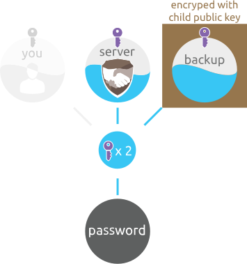
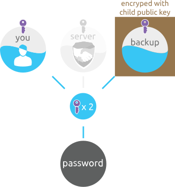

# Recovery

Recovery is just a reversed procedure from a [Credentials tier](https://github.com/zeropass/whitepaper/tree/11e905277aa925050db5761f02986a99c0abde42/credentials_tier.html). Usually, it requires [Backup tier](https://github.com/zeropass/whitepaper/tree/11e905277aa925050db5761f02986a99c0abde42/backup_tier.html) and [Key split](https://github.com/zeropass/whitepaper/tree/11e905277aa925050db5761f02986a99c0abde42/key_split.html) to be reversed too.

The recovery procedure involves waiting period before it can be initiated and cooperation from 2 out of 3 trusted contacts.

It is designed to be used once \(or maybe never\), this is why it's complexity should not be seen as prohibitive for users to employ when really needed \(catastrophic failure\).

Disclaimer: This is not a user's manual, many recovery options with additional permission policies are intentionally skipped over \(there is too many possible combinations\).

## Reconstruct the divided "password" from a backup

### 1\) If all of your devices get lost

There are 2 parts on ZeroPass servers. The second part and a backup part; encrypted with child public key \([ECIES](https://en.wikipedia.org/wiki/Integrated_Encryption_Scheme)\). When ZeroPass server receives enough verified signatures from trusted contacts \(at least 2\), it allows you to add a new device and delivers both parts to this new device.

For plain passwords to be reconstructed on your clean device;

* Reversal of the the [Key split](https://github.com/zeropass/whitepaper/tree/11e905277aa925050db5761f02986a99c0abde42/key_split.html) procedure to recover Master Private key 
* Reversal of the [Backup tier](https://github.com/zeropass/whitepaper/tree/11e905277aa925050db5761f02986a99c0abde42/backup_tier.html) to derive child private key
* Decrypt the encrypted backup part with it.
* Combine both parts with Shamir secret sharing; this part is the same as in [reconstruction in Credentials tier](https://github.com/zeropass/whitepaper/tree/11e905277aa925050db5761f02986a99c0abde42/credentials_tier.html).

Once all of your passwords are in plain again, they are re-encrypted with a new Master private key.

### 2\) If our server is gone \(unlikely\)

If ZeroPass service becomes unavailable \(unlikely\), or your account gets forcibly terminated \(unlikely\) you can still recover offline. All parts of the master key needed to recover passwords are split between you and your trusted contacts. You only need 2 out of 3 trusted contacts to send you your parts back \(they can find it in their app\) and you need to copy/paste them back into your \(now offline\) app.

The reversal procedure is then identical as in the previous point.

Once all of your passwords are decrypted, you can print them out, or export/import into other device/app.

### References:

