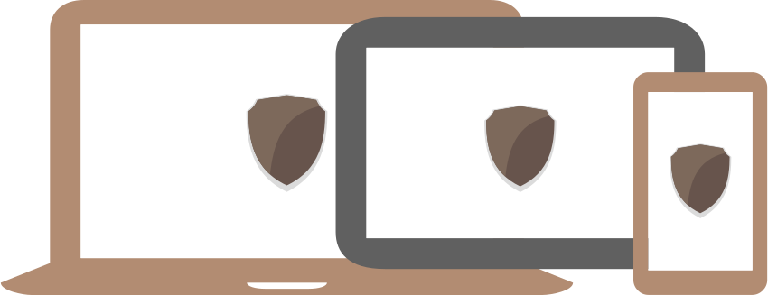

# \(Second\) Device

## Device key

Each user's device has it's own private Device key stored in local \(system specific\) keychain. Device key is used to sign all messages send by device and decrypt all received messages encrypted with device public key.

Device Public key is derived from Device key. This key is then used to establish secure encrypted communication between devices. Device can verify that incoming signed message comes from trusted source or send message to another device encrypted with recipient public key.

## Second Factor

If one of your devices sends a signed request to ZeroPass server to

* retrieve half of the password or part of Private Master Seed
* edit or delete essential \[password slot\] data including;
  * \[password slot\] name \(possible 'slot identity' spoofing\)
  * \[password slot\] password \(possible password deletion/overwrite\)
  * \[password slot\] username \(possible username spoofing\)

server doesn't trust it by default. Your device could be stolen/misused/buggy. Before delivering any kind of important information to the requesting device server requires signed conformation message from another pre-approved device.

### Devices

Any supported smart device can be added to the account. Before device is trusted it's public key has to be synced and approved by all existing \(already approved\) devices. After the approval device can sign "second factor" confirmation message.

### Alternatives

Default alternative is to use same device, but different private key to sign the massage. This private key needs to be encrypted with;

* Password \(any length, longer is safer\)
* Fingerprint sensor

We plan to add more options later

Losing any second factor device does not endanger recovery procedure

## References:

